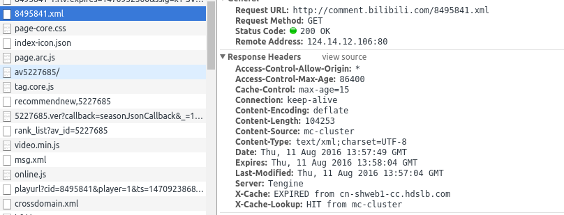

## 2233

- 目前是爬取指定av号的弹幕存到本地。原理是贴吧上看到的2233
- 弹幕信息有内容，时间，和时间2233
- 当初hackPKU的第三天上午撸了2,3小时的个说2233
- 使用方法 python bilibili.py av_number
  - 例如 python bilibili.py 10492 （这个资源被封了。好像有办法拿到。但不是我的关注点
  - python bilibili.py 1314520
- 合集的弹幕似乎有问题下一个commit再处理。
- 之后可能尝试做个api。。

## 说明

### 示例

### 怎么发现的

- 我是贴吧里发现这个的秘密2233
- 刚刚才看到那个包2233
- 然后全局找一下这串数字2233

### 压缩的理解

-  request 发送的'Accept-Encoding': 'gzip' 告诉服务器我这里支持这几种压缩的流？然后服务器支持的话会选择一种发。
-  听说 不加这一条会放回原始的数据，但是B站不行
-  response里可能会有。Content-Encoding:gzip 表示发给你的是gzip压缩的。
-  python中用 response.info().get('Content-Encoding')获取
-  视频页面是'gzip'压缩传过来的
-  弹幕xml是'deflate'压缩传过来的

### 版本说明
- 第一个版本，xml是用xml.dom.minidom这个库来解析的，看前三个commit
- 这个版本，cid用这正则来获取，加上了header（然并卵），bs4来解析xml

